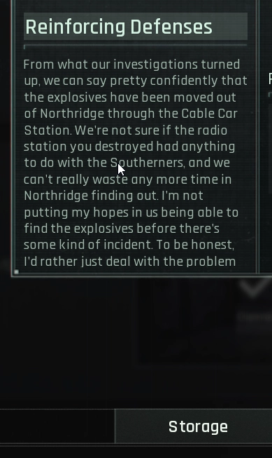

SAT(Simple AI Translator)는 OCR을 이용해 화면의 텍스트를 추출 후 번역하는 간단한 프로그램입니다.

이 프로젝트는 [MORT](https://github.com/killkimno/MORT) 프로젝트로부터 영감을 받아 만들어졌습니다.

# SAT - Simple AI Translator
SAT는 OCR을 이용해 화면 상의 텍스트를 캡처한 후, 사용자 설정에 따라 번역 서비스를 제공하는 프로그램입니다.

사용자 설정에 따라 텍스트만 추출/AI 번역/기계번역(구글)을 지원하며, AI 번역 사용 시 커스텀 프롬프트를 사용하여 맞춤 응답을 제공받을 수 있습니다.

# How to use
## Prerequisites
- [번역 대상 윈도우 언어 팩](https://support.microsoft.com/ko-kr/windows/windows%EC%9A%A9-%EC%96%B8%EC%96%B4-%ED%8C%A9-a5094319-a92d-18de-5b53-1cfc697cfca8)
- [gemini api 키](https://aistudio.google.com/api-keys) (optional)
## Usage
### [사용법 설명 링크](https://reinvented-oak-967.notion.site/SOTA-User-guide-2a14a4ebe77b801daf96f3de73345b7c)
1. 설치 프로그램을 다운받아 실행한 후, 바탕화면에 생성된 바로가기를 실행합니다.
2. 실행 시 뜨는 창에서 번역할 언어를 선택해 주세요.
3. `번역하기` 버튼 또는 설정된 단축키를 눌러 화면을 캡처합니다.
4. 프로그램 창에 한글로 번역된 결과가 출력되며, 프로그램 설정값에 따라 캡처 위치에 번역 결과를 오버레이로 표시합니다.

## System prompt
프롬프트는 상세한 지시 사항을 담고 있어야 하며, **"반드시 주어진 문장에 대한 번역만을 제공할 것" 이라는 지시 사항이 명확하게 포함되어야 합니다**

# MORT
MORT는 사용자가 지정한 영역을 OCR(광학 문자 인식) 기술로 읽어 들인 뒤, 원하는 번역 API(예: DeepL, Papago, Google Translate 등)를 통해 실시간으로 번역 결과를 제공합니다.

# Why not MORT?
MORT 프로그램은 많은 기능을 갖췄으며, 복잡하고 정밀한 기능을 제공하지만 몇 가지 문제점이 존재합니다.
* 핫키 등록 실패: 몇몇 게임에서는 키보드 입력을 MORT가 인식하지 못해 핫키 동작이 불가능합니다.
* 문장 파싱: MORT는 화면 상의 텍스트를 분석하여 문장 단위로 분리하는데, 일부 환경에서 잘못된 분류가 발생하고, 오역이 발생합니다.
* 캐싱: LLM 토큰을 절약하기 위해 MORT는 응답을 캐싱하는데, 잘못된 응답 또한 검사 없이 캐싱하여 번역의 질이 떨어집니다.

# Difference between MORT and this project
MORT는 게임의 스토리와 대사를 번역하기 위해 개발되었으며, 실시간 번역을 위해 캐싱 기능을 핵심적으로 지원합니다.

이러한 MORT의 특징은 중복이 적은 텍스트(툴팁, 시스템 설명 등)를 번역할 때 필요하지 않은 기능이며, 오히려 잘못된 응답을 캐싱하여 번역의 질을 저하시키는 문제가 발생할 수 있습니다.

SAT 프로젝트는 이러한 문제점을 해결하기 위해 개발되었습니다.
 
# Long-term, private project
이 프로젝트는 개인이 사용하기 위한 목적으로 개발되었습니다. 일부 기능은 미구현으로 남을 수 있으며, 이 프로젝트를 참조하여 개인 프로젝트에 활용할 수 있습니다.
